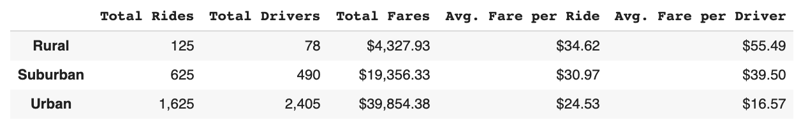
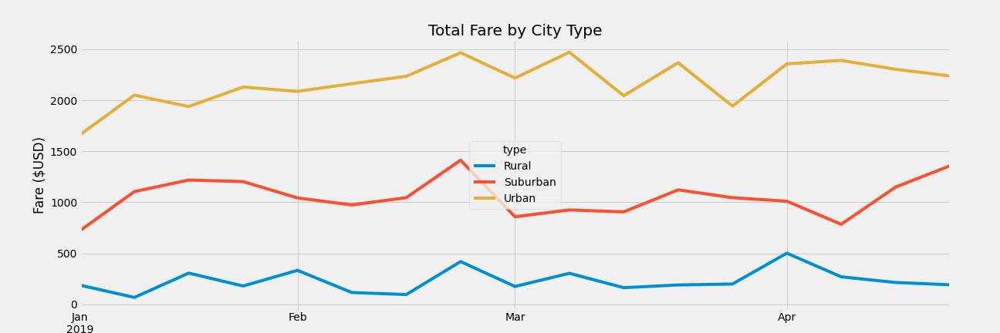

# Pyber Analysis

## Overview of Pyber

The purpose of this analysis is to examine the opportunity to increase ride availability to underserved rural areas.  

## Results

The Urban city type generates the most revenue but has the lowest averages of the other 3 types.  This is obviously due to the amount of drivers, however, this data could lead us to assume that the suburban and rural areas could benefit from an increased quantity of drivers which would result in more trips.  In this particular analysis it appears we should be more concerned with maximizing opportunities to generate a ride rather than higher per ride averages.  More drivers should equal more rides which should generate more revenue for both the Suburban and Rural city types.  

Rural and Suburban trips appear to follow a similar pattern with each city type experiencing a clear spike in February.  It would likely be beneficial to add additional drivers during this period in time to maximize the spike.  

## Summary

Based on this analysis the following recommendations are:
* Increase driver counts during February to maxmize the oppotunity for rides that occurs near the end of the month.
* Increase overall driver count and strive to maintain a driver count of 1.4 times the amount of rides.  This will drive down the average but will generate more revenue overall
* We should look into other data points:
    * Trip distance by city type
    * Driver availability by city type (How often do customer seek a ride but one is not available?)
